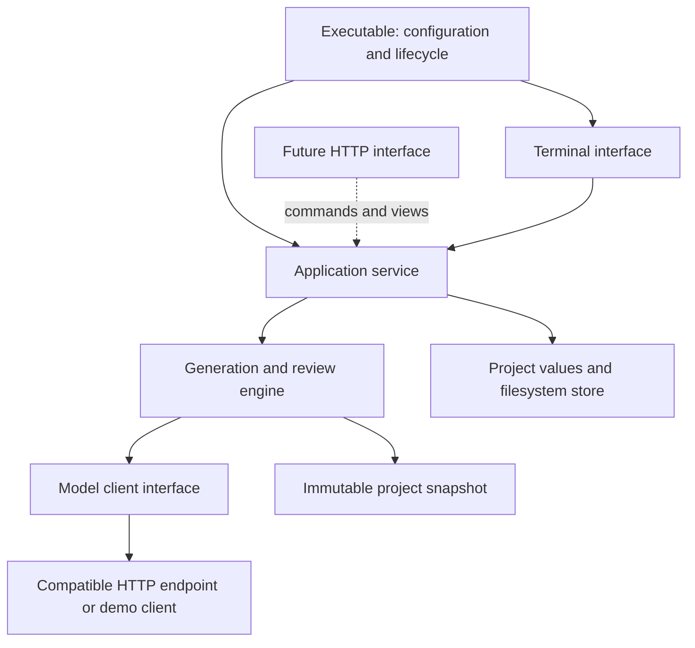

# Application and interface boundaries

Iterauthor is one Go application with a reusable application service. The TUI is its first interface. A future web interface can call the same service without taking ownership of generation, queue execution, source writes, or review rules.



## Responsibilities

| Package | Owns |
| --- | --- |
| `cmd/iterauthor` | Flags, initial project opening, model client construction, service construction, terminal startup, orderly shutdown. |
| `internal/application` | One open project, serialized commands, editing/busy/canceling state, queue eligibility and budgets, worker lifetime, result activation, conversation completion, proposal application, invalidation decisions, detached views and subscriptions. |
| `internal/engine` | One bounded generation/review operation, context selection, scoped tools, immutable source inputs, candidate creation and run checkpoints. It never activates prose or edits source files itself. |
| `internal/project` | Project value types, inheritance and validation, Markdown/JSON storage, process locking, source history, input fingerprints, run/conversation records, manuscript assembly and exports. |
| `internal/model` | The `Client` interface, compatible HTTP transport, request cancellation, response parsing and the explicit demo client. |
| `internal/tui` | Layout, focus, mouse/keyboard interactions, forms, unsaved buffers, rendering, dialogs, launching the external editor, and translating author actions into service commands. |

The TUI has no store pointer, model client, engine, worker goroutine, cancellation context, or queue budget. It can use project value types and inheritance calculations to explain settings. An architecture test rejects reverse dependencies, terminal dependencies in the core, and direct store access from the TUI.

`application.New(store, client, demo)` transfers exclusive ownership of the store to the service. After construction, callers must use the service rather than retain another path to mutable store fields. The concrete filesystem store remains sufficient for this experiment; there is no database abstraction or dependency injection framework.

## Commands and queries

The service is an in-process Go API, not an HTTP API. Its inputs and returned values contain no terminal widgets or HTTP request objects.

| Author operation | Service API |
| --- | --- |
| Inspect project and current work | `View`, `Revision`, `Subscribe` |
| Read sources, runs, conversations and history | `Read`, `Snapshot`, `Runs`, `LoadRun`, `Conversations`, `LoadConversation`, `SourceHistory`, `ReadSourceVersion` |
| Edit sources and settings | `BeginEditing`, `SaveText`, `SaveConfig`, `AddChild`, `AddEntry`, `FinishEditing` |
| Reconcile external editing | `PrepareExternalEdit`, `Reload` |
| Generate passages | `Generate(Selection, force)` with branch, selected passages, or story scope |
| Generate outline detail or test tools | `Start(Job)` |
| Work with the assistant | `NewConversation`, `SetConversationModel`, `Send`, `SaveDraft` |
| Apply or invalidate generated work | `UseCandidate`, `ImportOutline`, `ApplyEdits`, `Invalidate`, `InvalidateRun` |
| Resolve saved source changes | `Decide` by change ID, or `DecideAll` |
| Assemble/export | `Manuscript`, `Export` |
| End work or change projects | `Cancel`, `SwitchProject`, `Shutdown` |

`View` returns copies of config, passage state and queue information. Editing those copies cannot change the running project. Configuration forms submit the `ConfigVersion` received when opened; stale forms are rejected. Source saves supply the original text. Run application uses persisted run IDs and candidate indices, so an interface cannot accidentally substitute its own cached run body. Source edit proposals are checked in full for scope, permitted fields and freshness before any writes begin.

For example, a future interface can use the following sequence against an existing service:

```go
view := core.View()
config := view.Config
config.AutoGenerate = true
if err := core.SaveConfig(config, "Enable automatic generation", config.Root, view.ConfigVersion); err != nil {
    return err
}
// Show the pending changes and collect the author's chosen disposition.
// Once those decisions have been submitted:
return core.FinishEditing()
```

Explicit generation submits a selection and returns after admission, rather than waiting for the model:

```go
err := core.Generate(application.Selection{
    Scope: "branch", Target: outlineID,
}, false)
```

The service enforces the active-work interlock and unresolved-change rule. A UI may disable unavailable buttons or explain an error, but those controls are not the enforcement mechanism. Unsaved text and form buffers remain interface state; each interface must prevent the author from submitting generation while its own source buffer is still open. This build is a single-author workflow, not collaborative editing with distributed edit leases.

## Work continues independently of rendering

The service owns one worker for an entire queue. Each leaf receives a frozen snapshot, the remaining shared call budget and the queue deadline. After a run, the service offers its candidate for activation, saves any conversation reply to its original conversation ID, and advances the queue itself. The following leaf receives a fresh snapshot including any prose just activated. No UI callback performs these steps.

`Subscribe` returns a bounded channel of coalesced wakeups and an idempotent unsubscribe function. An interface reads `View` after a wakeup. Wakeups are hints to refresh, not a durable event stream: intermediate progress can be coalesced, and run/history queries provide the retained evidence. An absent, slow, or disconnected observer cannot block generation. The TUI posts nonblocking terminal wakeups and handles completion actions outside tview's drawing lock.

Stopping `UI.Run` detaches that observer. The executable owns service lifetime and calls `Shutdown` when exiting. This distinction lets a web server keep the service alive when one browser closes.

Cancellation clears pending queue entries and signals the active operation. `Busy` remains true until the worker finishes checkpointing and saving its result. `Shutdown(ctx)` waits for that completion before closing the filesystem store and releasing the project lock. If the wait times out, the service remains closed to new commands and retains the lock; the host may retry shutdown. Calling `Cancel` or unsubscribing does not close the project.

## Adding a web interface

Add HTTP handlers and browser assets as another adapter, with an executable that constructs the same service and model client. Handlers translate requests into the commands above and return values/errors; an SSE or WebSocket connection can translate subscription wakeups into refreshed views. Browser disconnection should unsubscribe that observer, not cancel project work. Use one service per open project in that server rather than switching a shared service between unrelated browser sessions.

Routing, authentication, session ownership, unsaved browser buffers, reconnect behavior and presentation still need design. They belong at the interface/host boundary. A web adapter must expose deliberate author operations; it should not blindly export local filesystem paths or the local external-editor command. No web server is included in this build.

The current single-process project lock, global editing pause, non-resumable queues, and individually atomic file writes remain deliberate prototype limits. Multiple independent processes cannot write the same project. Fingerprint checks detect external changes but are not an atomic compare-and-swap against arbitrary external editors, and multi-file edits are not crash-atomic transactions. Changing those capabilities later is core/storage work shared by all interfaces.

## Evidence

Headless application tests exercise unattended queues, an unresponsive subscriber, shared budgets, author-prose protection, cancellation/shutdown locking, conversation persistence, stale saves, scoped proposal validation, outline import/invalidation, automatic generation, project switching and subscription cleanup. Terminal tests separately cover navigation and editing, detached-worker completion, completion dialogs, and preserving unsent conversation text during cancel-and-quit.
