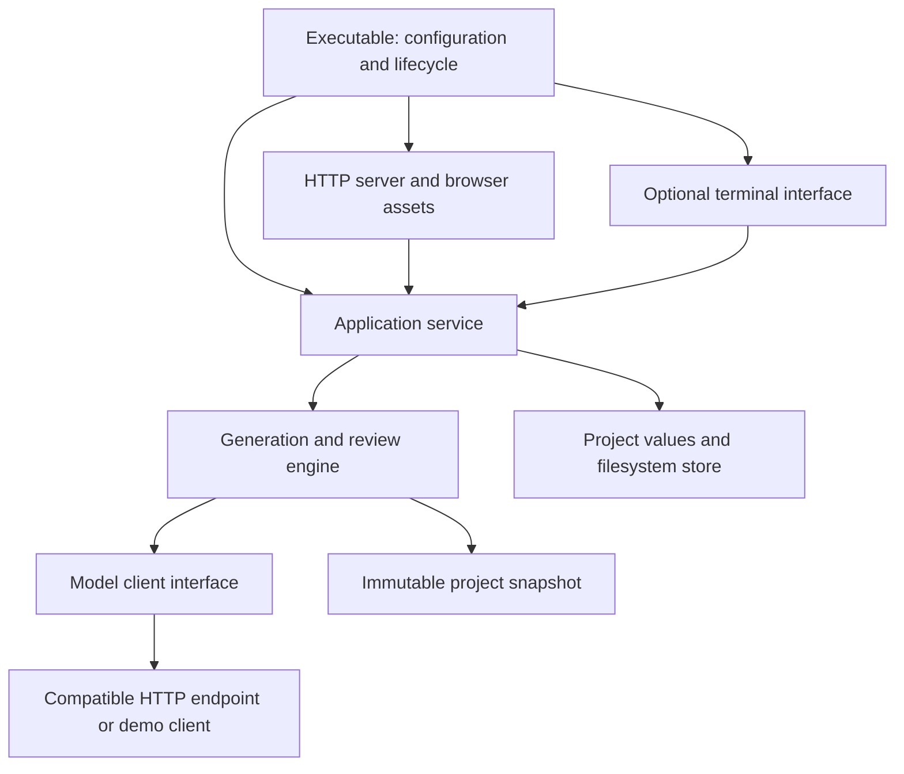

# Application and interface boundaries

Iterauthor is one Go application with a reusable application service. The embedded HTTP/browser interface is the default; the TUI remains an optional adapter. Both call the same service without owning generation, queue execution, source writes, or review rules.



## Responsibilities

| Package | Owns |
| --- | --- |
| `cmd/iterauthor` | Flags, initial project opening, model client construction, service construction, interface startup, configured listener, signal handling, orderly shutdown. |
| `internal/application` | One open project, serialized commands, editing/busy/canceling state, queue eligibility and budgets, worker lifetime, result activation, conversation completion, proposal application, invalidation decisions, detached views and subscriptions. |
| `internal/engine` | One bounded generation/review operation, context selection, scoped tools, immutable source inputs, candidate creation and run checkpoints. It never activates prose or edits source files itself. |
| `internal/project` | Project value types, inheritance and validation, Markdown/JSON storage, process locking, source history, input fingerprints, run/conversation records, manuscript assembly and exports. |
| `internal/model` | The `Client` interface, compatible HTTP transport, request cancellation, response parsing, URL/model discovery, connection capability testing, and the explicit demo client. |
| `internal/web` | Embedded browser assets, HTTP commands/queries, request-origin checks, SSE subscription lifecycle, browser forms, and unsaved buffers. |
| `internal/tui` | Layout, focus, mouse/keyboard interactions, forms, unsaved buffers, rendering, dialogs, launching the external editor, and translating author actions into service commands. |

Neither interface has a store pointer, model client, engine, worker goroutine, cancellation context, or queue budget. It can use project value types and inheritance calculations to explain settings. An architecture test rejects reverse dependencies, terminal dependencies in the core, and direct store access from either interface.

`application.New(store, client, demo)` transfers exclusive ownership of the store to the service. After construction, callers must use the service rather than retain another path to mutable store fields. The concrete filesystem store remains sufficient for this experiment; there is no database abstraction or dependency injection framework.

## Commands and queries

The service is an in-process Go API, not an HTTP API. Its inputs and returned values contain no terminal widgets or HTTP request objects.

| Author operation | Service API |
| --- | --- |
| Inspect project and current work | `View`, `Revision`, `Subscribe` |
| Read sources, runs, conversations and history | `Read`, `Snapshot`, `Runs`, `LoadRun`, `Conversations`, `LoadConversation`, `SourceHistory`, `ReadSourceVersion` |
| Edit sources and settings | `BeginEditing`, `SaveText`, `SaveConfig`, `AddChild`, `AddEntry`, `FinishEditing` |
| Reconcile external editing | `PrepareExternalEdit`, `Reload` |
| Generate passages | `Generate(Selection, force)` with branch, selected passages, or story scope |
| Discover and configure model connections | `SaveConnection`, `RefreshConnection`, `RunModelRefresh`, `DiscoverModels`, `ProbeModel`, `SaveModel` |
| Generate outline detail or test tools | `Start(Job)` |
| Work with the assistant | `NewConversation`, `SetConversationModel`, `Send`, `SaveDraft` |
| Apply or invalidate generated work | `UseCandidate`, `ImportOutline`, `ApplyEdits`, `Invalidate`, `InvalidateRun` |
| Resolve saved source changes | `Decide` by change ID, or `DecideAll` |
| Assemble/export | `Manuscript`, `Export` |
| End work or change projects | `Cancel`, `SwitchProject`, `Shutdown` |

`View` returns copies of config, passage state and queue information. Editing those copies cannot change the running project. Configuration forms submit the `ConfigVersion` received when opened; stale forms are rejected. Source saves supply the original text. Run application uses persisted run IDs and candidate indices, so an interface cannot accidentally substitute its own cached run body. Source edit proposals are checked in full for scope, permitted fields and freshness before any writes begin.

Editing commands never start inference. `FinishEditing` only ends the editing pause; it does not start or resume a queue. The legacy `Config.AutoGenerate` field is ignored even when true in an existing project. Only explicit `Generate`, `Start`, `Send`, and `ProbeModel` requests can run models. Source changes and revisit decisions remain independent of the author's choice to generate.

Explicit generation submits a selection and returns after admission, rather than waiting for the model:

```go
err := core.Generate(application.Selection{
    Scope: "branch", Target: outlineID,
}, false)
```

The service enforces the active-work interlock and unresolved-change rule. A UI may disable unavailable buttons or explain an error, but those controls are not the enforcement mechanism. The store classifies settings changes and records planning edits without requiring prose review when no active prose or retained prose candidates exist. Operational settings apply to future work; writing inputs and effective model selections require decisions when prose exists. This policy applies equally to browser, terminal, assistant-applied edits, and external Reload.

Configuration version tokens and raw file hashes continue to cover all configuration fields for stale-save and external-edit detection. Generation fingerprints cover writing inputs and effective model selections, excluding connection plumbing, unused models, execution budgets, and scheduling. `.twriter/inputs.json` checkpoints raw hashes with `@writing-config` and `@generation` metadata; unchanged legacy projects retain their existing generation identity on upgrade. Operational changes therefore do not invalidate saved proposals, while external operational edits still require Reload.

Unsaved text and form buffers remain interface state; each interface must prevent the author from submitting generation while its own source buffer is still open. This build is a single-author workflow, not collaborative editing with distributed edit leases.

## Work continues independently of rendering

The service owns one worker for an entire queue. Each leaf receives a frozen snapshot, the remaining shared call budget and the queue deadline. After a run, the service offers its candidate for activation, saves any conversation reply to its original conversation ID, and advances the queue itself. The following leaf receives a fresh snapshot including any prose just activated. No UI callback performs these steps.

`Subscribe` returns a bounded channel of coalesced wakeups and an idempotent unsubscribe function. An interface reads `View` after a wakeup. Wakeups are hints to refresh, not a durable event stream: intermediate progress can be coalesced, and run/history queries provide the retained evidence. An absent, slow, or disconnected observer cannot block generation. The TUI posts nonblocking terminal wakeups and handles completion actions outside tview's drawing lock.

`View.Work` identifies the current or most recent operation, including its conversation, target, start/finish timestamps, run ID, call count, and outcome. It is a detached value; completion remains inspectable after `Busy` becomes false. Conversation replies persist result status and proposal counts, with saved-run lookup for older turns. The HTTP composition root enables the service's structured lifecycle logger; log entries omit source/prompt/reply bodies. Model request and tool checkpoints drive both logs and interface progress. Browser elapsed-time rendering does not schedule or advance work.

Stopping `UI.Run` detaches that observer. The executable owns service lifetime and calls `Shutdown` when exiting. This distinction lets a web server keep the service alive when one browser closes.

Cancellation clears pending queue entries and signals the active operation. `Busy` remains true until the worker finishes checkpointing and saving its result. `Shutdown(ctx)` waits for that completion before closing the filesystem store and releasing the project lock. If the wait times out, the service remains closed to new commands and retains the lock; the host may retry shutdown. Calling `Cancel` or unsubscribing does not close the project.

## HTTP adapter

`internal/web` serves embedded HTML/CSS/JavaScript and an explicit JSON API. Read routes expose sources, history, runs, conversations, settings, and manuscript text. `/api/command` maps named author actions to service methods. Model discovery and connection tests have separate endpoints. The browser never receives a store pointer or an API-key value.

`/api/events` translates coalesced service notifications into SSE wakeups. Browser code refreshes detached views and preserves unsaved buffers. Disconnecting unsubscribes that listener; the application's worker continues independently. Reconnecting obtains the latest state. Connection tests temporarily use the core busy/cancellation interlock; unlike submitted story jobs, they are canceled if their requesting HTTP connection ends.

The executable defaults to localhost and honors explicit network bind addresses, including wildcard IPv4/IPv6 listeners. Request middleware accepts the hostname or IP used to reach that listener, while rejecting foreign origins, cross-site fetches, and POST requests without the custom JSON request header. No CORS access is granted. Direct browser access and SSH forwarding both work. This remains a single-author server without authentication or multi-user authorization: every client that can reach it has access to the open project.


HTTP handlers do not expose arbitrary file paths, shell commands, or the TUI's external-editor launcher. Config writes use version tokens, text writes carry the expected original, and proposals use persisted run identities. Browser controls explain the interlocks while the application service enforces them. Unsaved buffers are per browser tab; use one authoring tab at a time.

The current single-process project lock, global editing pause, non-resumable queues, and individually atomic file writes remain deliberate prototype limits. Multiple independent processes cannot write the same project. Fingerprint checks detect external changes but are not an atomic compare-and-swap against arbitrary external editors, and multi-file edits are not crash-atomic transactions. Changing those capabilities later is core/storage work shared by all interfaces.

## Evidence

Headless application tests exercise unattended queues, an unresponsive subscriber, shared budgets, author-prose protection, cancellation/shutdown locking, conversation persistence, stale saves, scoped proposal validation, outline import/invalidation, explicit generation with legacy automatic scheduling disabled, project switching and subscription cleanup. Terminal tests separately cover navigation and editing, detached-worker completion, completion dialogs, and preserving unsent conversation text during cancel-and-quit.

## API connections and inference options

`Config.Connections` stores named API addresses and credential environment references. Models retain stable IDs and point to a connection; old inline endpoints are grouped in the service view without rewriting source files on open. A catalog refresh is a read-only network operation followed by an atomic metadata-cache write to `.twriter/catalogs.json`. It can run during generation without source locks, configuration-version changes, or invalidation. Stale responses from an edited connection or switched project are discarded. The application host runs the one-minute refresh loop, independent of browser tabs.

Service views merge saved model definitions with the current catalog. Selecting a new catalog model freezes its definition before a job or conversation can reference it. Model IDs include the connection identity, so identical names at different APIs/accounts do not collide. Missing models and offline APIs keep their saved assignments; no fallback is selected. Worker snapshots resolve connection addresses and freeze catalog metadata at admission.

`InferenceFor` resolves output and reasoning settings in order: project output limit, model defaults, feature overrides, and ancestor-to-leaf overrides. A nil output pointer inherits; zero omits the app's output cap. Empty reasoning inherits; `default` explicitly restores provider defaults. Inference settings apply to future runs and do not demand prose review. Effective options are recorded on each model-call trace. Provider usage details remain optional because not every compatible API reports input, completion, or reasoning tokens separately.

Reasoning uses `reasoning_effort` for compatible APIs, translating off/on to none/medium. llama.cpp or an explicit chat-template mode uses `chat_template_kwargs`. Model-reported reasoning options are checked before sending; there is no silent setting downgrade. Compatibility depends on the server/model implementation, and a successful request alone cannot prove a server honored a reasoning control. Unlimited output omits the token field; it does not promise an unlimited server context or override server defaults. The operation deadline (zero means none), model-call limit, and draft-attempt limit are independent controls.
